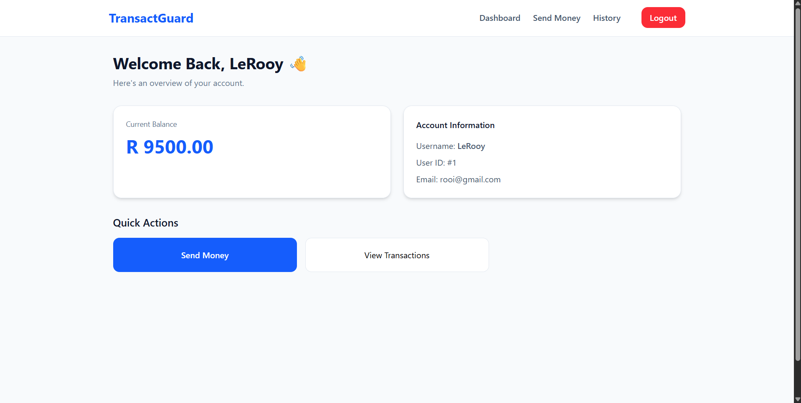
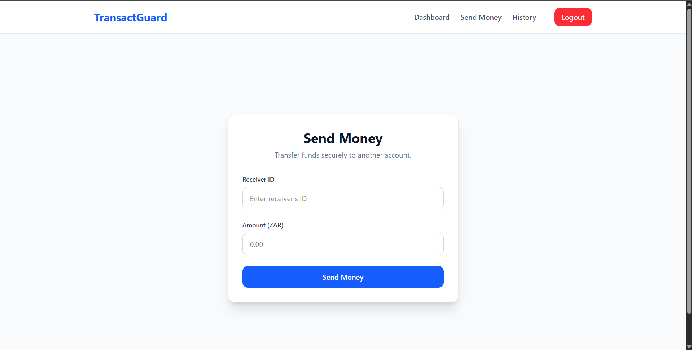
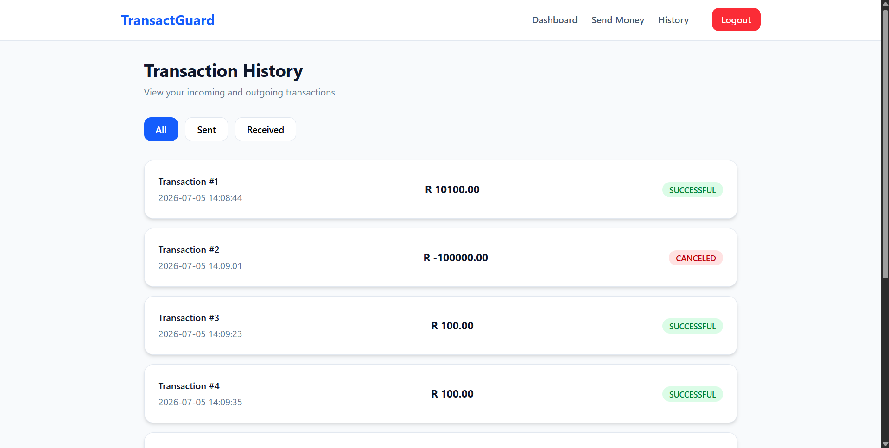
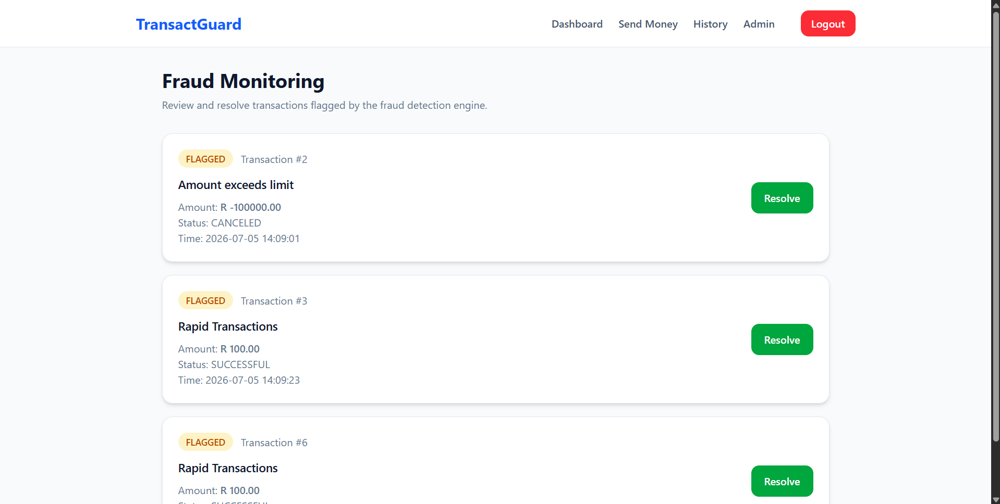

# TransactGuard Frontend

A modern React frontend for **TransactGuard**, a secure banking application demonstrating authentication, transaction management, fraud detection, and role-based administration.

> **Backend Repository:** https://github.com/Ofentse-Magidela/transactguard  
> **Frontend Repository:** https://github.com/Ofentse-Magidela/transactguard-frontend

---

## Overview

TransactGuard is a full-stack banking application built to demonstrate backend engineering concepts while providing a clean and responsive user interface.

The frontend communicates with a Spring Boot REST API secured with JWT authentication and provides an intuitive interface for users and administrators.

---

## Features

### Authentication

- User Registration
- User Login
- JWT Authentication
- Protected Routes
- Role-Based Navigation

---

### User Dashboard

- View account balance
- View profile information
- Navigate through application features

**Screenshot**



### Send Money

- Secure money transfers
- Input validation
- Backend integration
- Automatic balance updates

**Screenshot**



### Transaction History

- View all transactions
- Filter by:
  - All
  - Sent
  - Received
- Transaction status indicators

**Screenshot**



### Admin Panel

Available only to administrators.

- View fraud flags
- Review suspicious transactions
- Resolve fraud cases

**Screenshot**



## Technology Stack

### Frontend

- React
- React Router
- Axios
- Tailwind CSS
- Vite

### Backend

- Spring Boot
- Spring Security
- JWT Authentication
- Hibernate / JPA
- MySQL

---

## Authentication Flow

```
Login
    │
    ▼
Receive JWT
    │
    ▼
Store Authentication Context
    │
    ▼
Protected Routes
    │
    ▼
Secure API Requests
```

---

## Fraud Detection Workflow

```
Money Transfer
      │
      ▼
Backend Fraud Engine
      │
      ▼
Fraud Flag Created
      │
      ▼
Administrator Reviews Flag
      │
      ▼
Flag Resolved
```

---

## Running Locally

### Clone the repository

```bash
git clone https://github.com/Ofentse-Magidela/transactguard-frontend.git
```

### Install dependencies

```bash
npm install
```

### Start the development server

```bash
npm run dev
```

The application expects the Spring Boot backend to be running locally.

---

## Project Structure

```
src
│
├── components/
│
├── context/
│
├── pages/
│
├── service/
│
├── routes/
│
└── main.jsx
```

---

## Future Improvements

Planned enhancements include:

- Docker deployment
- CI/CD pipeline
- Email verification
- Audit logging
- Rate limiting
- Redis caching
- Production cloud deployment

---

## AI Usage

AI was used **solely to accelerate the implementation of the Tailwind CSS user interface**.

All application architecture, React component structure, routing, state management, authentication flow, API integration, conditional rendering, business logic, and backend implementation were designed and implemented by me.

---

## Author

**Ofentse Magidela**

Computer Science Student

Backend-focused Software Engineering Enthusiast