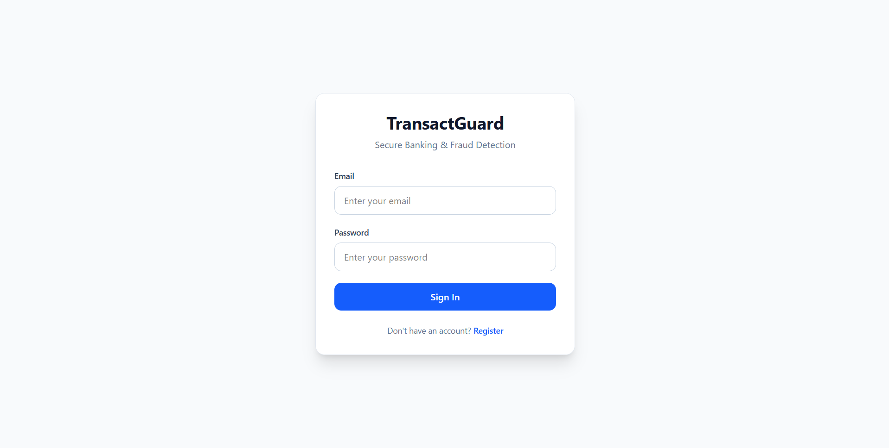
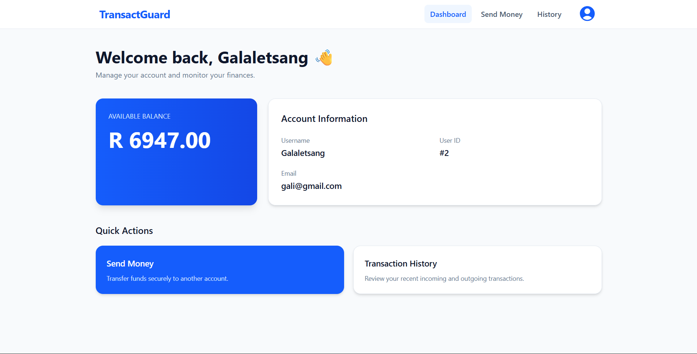
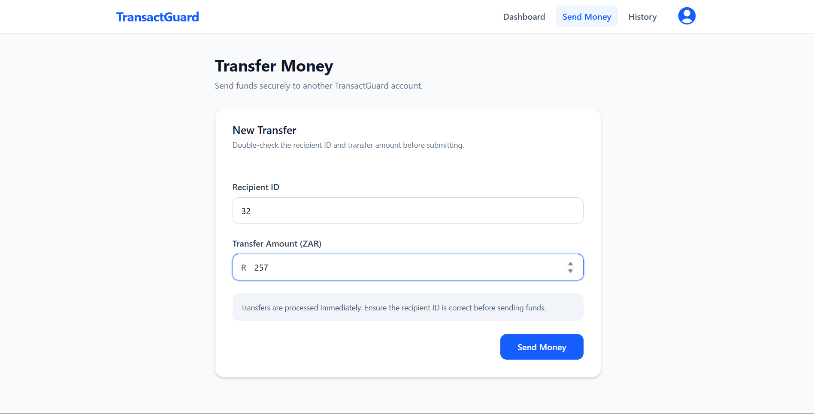
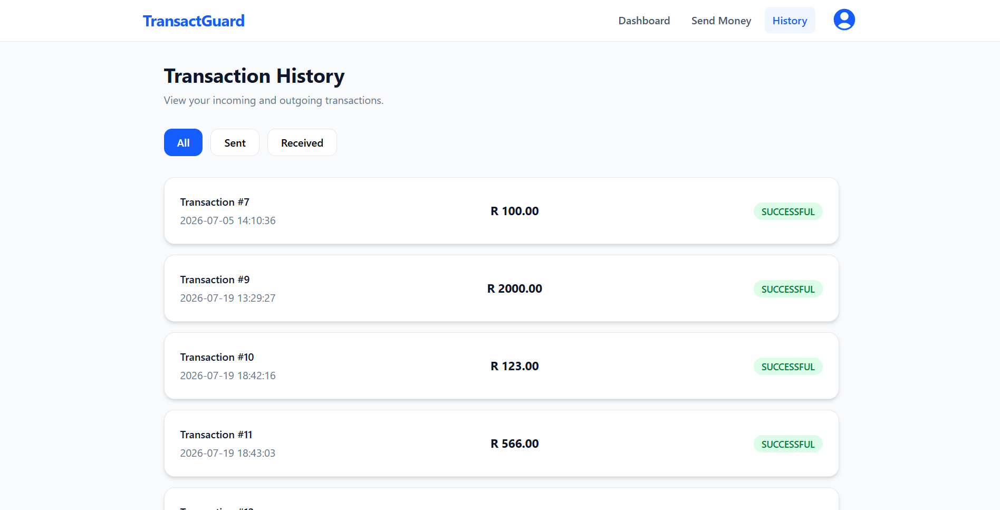
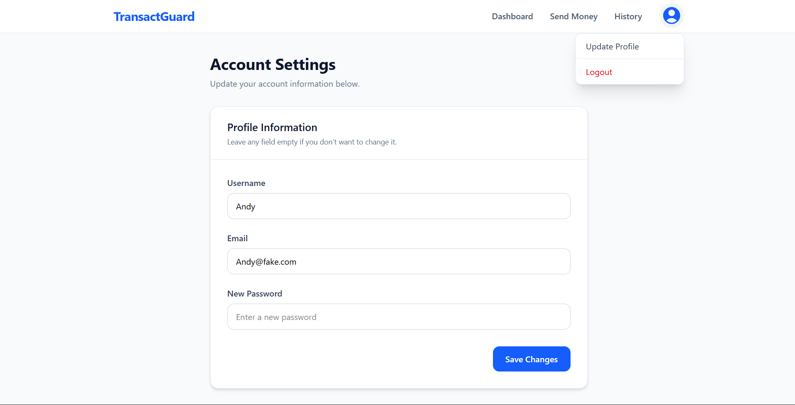
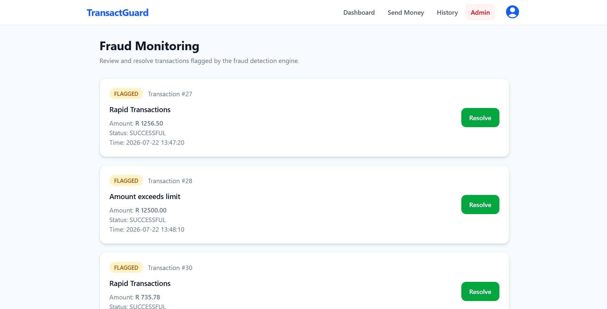

# 🛡️ TransactGuard Client Application


Frontend application for **TransactGuard**, a secure banking platform built with React and Vite. The application communicates with a Spring Boot backend using JWT authentication and provides a responsive interface for managing accounts, transactions, and fraud management.

---

## Features

- User registration and login
- JWT authentication
- Protected routes
- Send money between users
- View transaction history
- Display account balance
- Update account information
- Admin fraud management dashboard
- Client-side form validation
- Structured backend error handling
- Responsive interface
- Custom 404 page

---

## Preview

| Login | Dashboard |
|-------|-----------|
|  |  |

| Send Money | Transactions |
|------------|--------------|
|  |  |

| Update Profile | Admin Dashboard |
|----------------|-----------------|
|  |  |

---

## Tech Stack

- React
- Vite
- React Router
- Axios
- JWT Decode
- Tailwind CSS

---

## Architecture

The frontend communicates with the TransactGuard backend through a REST API using Axios. Authentication state is managed with React Context, while React Router protects authenticated pages from unauthorized access. The application performs client-side validation and presents structured validation and error responses returned by the backend, providing clear feedback to users during authentication, profile management, and transactions.

---

## 📂 Project Structure

```text
src/
├── assets/
├── components/
├── context/
├── pages/
├── service/
├── App.jsx
└── main.jsx
```

---

## Getting Started

### Clone the repository

```bash
git clone https://github.com/Ofentse-Magidela/transactguard-frontend.git
```

### Install dependencies

```bash
npm install
```

### Run the development server

```bash
npm run dev
```

---

## 🔧 Backend

This frontend communicates with the TransactGuard Spring Boot API.

Repository:

https://github.com/Ofentse-Magidela/transactguard

---

## 🌍 Deployment

Frontend

https://transactguard.vercel.app

Backend API

https://transactguard-backend.onrender.com

---

## Author

**Ofentse Magidela**

GitHub: https://github.com/Ofentse-Magidela

---


## 📄 License

This project is for educational and portfolio purposes.

---

## AI Assistance

AI tools were used to accelerate parts of the frontend development process, primarily for UI styling, layout refinement, and general productivity. All application logic, component integration, API communication, authentication flow, state management, and project architecture were implemented, reviewed, and adapted by the author.
